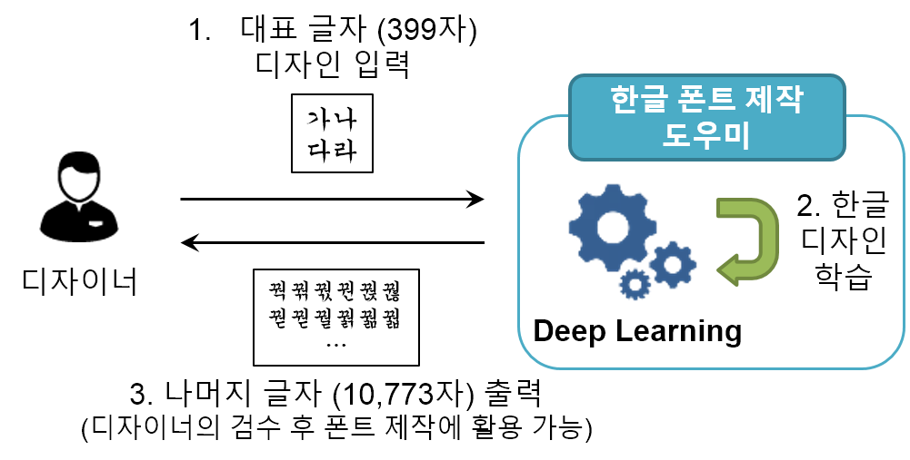
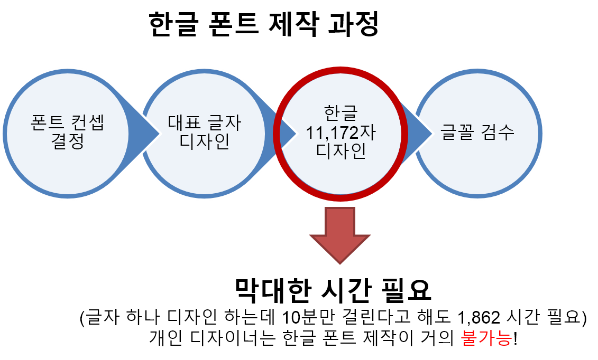
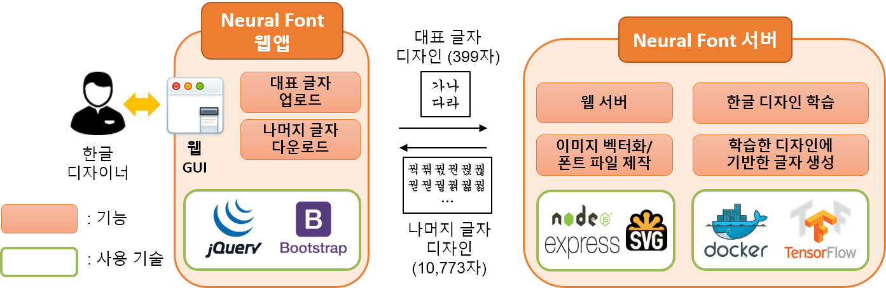

# Neural-fonts-webapp

### Introduction
---
Neural fonts web app 은 한글 폰트 제작의 어려움을 덜기 위해, 사용자가 대표 글자 양식을 업로드 하면 그 글자의 디자인을 학습하여 다른 글자들의 이미지를 생성해주는 소프트웨어 입니다.

  

### Motivation
-----

  

한글 폰트 제작 시 필요한 막대한 시간을 단축시키기 위해 Neural fonts web app 은 딥러닝 기술을 이용해 대표 글자 디자인으로부터 한글 디자인을 생성해냄.

### Technology stack
-----

  

### How to Use
----------
Neural fonts web app 을 수행하기 위해서는 먼저 tensorflow가 설치된 docker를 background에서 동작시키고, 그 다음에 Node.js 로 구현된 웹서버를 동작시켜야 합니다.
웹서버를 동작시킨 이후에는 브라우저를 통해 Neural fonts web app을 수행할 수 있습니다.
아래는 설치와 수행 가이드 입니다.
(모든 test 는 Ubuntu 16.04 가 설치된 pc에서 진행되었습니다.)

### Installation
-----
1. Install Node.js
2. Install NPM, if necessary
3. Install NPM packages
	> $ npm install
4. Install docker ce (reference : https://docs.docker.com/engine/installation/linux/docker-ce/ubuntu/)
5. Install nvidia-docker and nvidia-docker plugin (reference : https://github.com/NVIDIA/nvidia-docker/wiki)

### Execution
-----
1. Run tensorflow docker and install some necessary libraries on the docker container
	> $ nvidia-docker run -v /path/to/neural-fonts:/home/neural-fonts -w /home/neural-fonts --name neural_font -dit gcr.io/tensorflow/tensorflow:latest-gpu bash
	> $ docker exec -it neural_font pip install imageio
	> $ docker exec -it neural_font pip install scikit-image

2. Run Neural fonts web app
	> $ node app.js

	Then Neural fonts web app will be available at: localhost:3000 (or your.server.ip:3000)

### In web page
-----
1. 399자의 글자를 적을 수 있는 대표 글자 템플릿을 다운받은 후 양식에 맞춰 손글씨를 적어 스캔하거나, illustrator 등의 도구를 이용해 한글 디자인을 제작합니다.

2. 시작하기 버튼을 클릭하고 준비한 파일을 업로드 합니다.

3. Neural fonts 는 업로드된 한글 디자인을 학습합니다. 이 과정은 한글 디자인을 흉내내는 인공신경망이 학습되는 과정으로, Titan X GPU 를 가진 서버에서 대략 30분 가량 소모됩니다.

4. 학습이 끝나면 생성된 글자 디자인의 샘플이 보여집니다.

	>- 디자이너는 샘플을 폰트로 만들기 전에 벡터화 하는 과정에서 파라미터를 조정하여 굵기나 선의 거친 정도를 조절할 수 있습니다.

	>- 파라미터는 스크롤바를 이용해 조절할 수  있으며, 파라미터르 조정한 history 를 저장하거나 복구할 수 있습니다.

6. 마지막으로 Download 버튼을 누르면 최종적으로 완성된 폰트 파일(ttf 파일) 을 다운받을 수 있습니다.

### Examples
-----

  

## Acknowledgements
We used GAN architecture from zi2zi, an open source project which aims at learning Chinese character style with conditional GAN.
We changed zi2zi to support Korean character sets and generate font file (ttf). Also, we changed some designs to reduce training time.
See our release notes to take a closer look on the differences between zi2zi and Neural fonts web app.
* [zi2zi](https://github.com/kaonashi-tyc/zi2zi) by [yenchenlin](https://github.com/yenchenlin)

License
-----
MIT.

